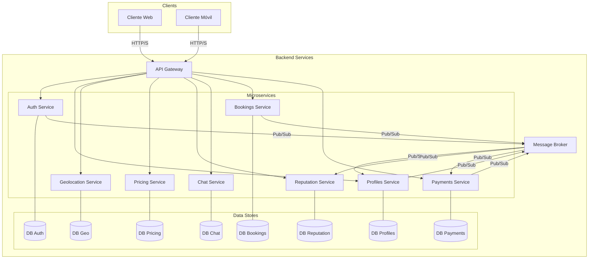

# Arquitectura Backend - LABURAPP

## 1. Introducción

Este documento describe la arquitectura de alto nivel para el backend de la plataforma LABURAPP, un marketplace de servicios que conecta a proveedores con clientes, incorporando geolocalización, biometría y un sistema de pagos integrado. El objetivo es diseñar un sistema escalable, seguro, modular y mantenible.

## 2. Estilo de Arquitectura: Microservicios

Hemos optado por una **arquitectura de microservicios** para desacoplar las responsabilidades del sistema en componentes independientes y autónomos.

**Ventajas:**

*   **Escalabilidad Independiente:** Cada servicio puede escalar horizontalmente según su carga específica.
*   **Flexibilidad Tecnológica:** Permite utilizar diferentes tecnologías para distintos servicios si es necesario.
*   **Resiliencia:** Un fallo en un servicio no tiene por qué afectar al resto del sistema.
*   **Mantenibilidad:** Los equipos pueden desarrollar, desplegar y mantener los servicios de forma independiente.
*   **Despliegue Continuo:** Facilita la implementación de pipelines de CI/CD para entregar valor de forma más rápida.

## 3. Stack Tecnológico Propuesto

| Componente              | Tecnología Recomendada                                 | Alternativas                               | Justificación                                                                      |
| ----------------------- | ------------------------------------------------------ | ------------------------------------------ | ---------------------------------------------------------------------------------- |
| **Lenguaje/Framework**  | Node.js con TypeScript (Express / Fastify)             | Python (FastAPI), Go (Gin)                 | Ideal para operaciones I/O intensivas (APIs, chat). Gran ecosistema y rendimiento.  |
| **Base de Datos**       | PostgreSQL con PostGIS                                 | MySQL, MongoDB                             | Robusto, relacional, excelente para datos transaccionales y consultas geoespaciales. |
| **Caché**               | Redis                                                  | Memcached                                  | Almacenamiento en memoria de alta velocidad para sesiones, datos temporales y cacheo. |
| **Message Broker**      | RabbitMQ                                               | Apache Kafka                               | Para comunicación asíncrona y eventos entre microservicios. Seguro y fiable.       |
| **API Gateway**         | Kong / Tyk (Gestionado) o Express Gateway (Custom)     | NGINX, Ocelot (.NET)                       | Punto de entrada único que gestiona routing, autenticación, rate limiting y logging. |
| **Contenerización**     | Docker                                                 | -                                          | Estandariza el entorno de desarrollo y producción.                                 |
| **Orquestación**        | Kubernetes (K8s)                                       | Docker Swarm, Nomad                        | Automatiza el despliegue, escalado y gestión de aplicaciones en contenedores.      |
| **CI/CD**               | GitHub Actions / GitLab CI                             | Jenkins                                    | Automatización de builds, tests y despliegues directamente desde el repositorio.     |

## 4. Diagrama de Arquitectura

## 5. Resumen de Microservicios

1.  **Servicio de Autenticación:** Gestiona el registro, login, validación biométrica (OCR+selfie), 2FA, y la emisión/validación de tokens JWT.
2.  **Servicio de Perfiles:** Administra toda la información del usuario (datos personales, KYC, certificaciones, experiencia).
3.  **Servicio de Geolocalización:** Maneja el registro de ubicaciones, cálculos de distancia y búsquedas geo-optimimizadas.
4.  **Servicio de Motor de Precios:** Calcula tarifas dinámicas basadas en distancia, urgencia, reputación y demanda.
5.  **Servicio de Reputación:** Gestiona ratings, comentarios y niveles de reputación de los usuarios.
6.  **Servicio de Chat:** Provee comunicación en tiempo real entre usuarios (usando WebSockets).
7.  **Servicio de Reservas:** Administra la disponibilidad, turnos y reservas de servicios.
8.  **Servicio de Pagos:** Se integra con pasarelas de pago (Mercado Pago, Stripe) para manejar la wallet, depósitos, retiros y comisiones.
9.  **Servicio de Notificaciones (No en diagrama):** Envía notificaciones push, email o SMS a los usuarios.
10. **Servicio de Admin Panel:** Provee endpoints para la gestión global de la plataforma.

## 6. Patrones de Comunicación

*   **Síncrona (API Gateway -> Servicios):** Los clientes interactúan con el backend a través de un API Gateway que enruta las peticiones a los microservicios correspondientes vía API REST. Es ideal para peticiones que requieren una respuesta inmediata (ej. solicitar un perfil de usuario).
*   **Asíncrona (Servicio a Servicio):** Los servicios se comunican entre sí mediante eventos a través de un Message Broker. Esto desacopla los servicios y aumenta la resiliencia.
    *   **Ejemplo:** Cuando un usuario se registra, el servicio de `Autenticación` publica un evento `UsuarioCreado`. El servicio de `Perfiles` y `Notificaciones` están suscritos a este evento para crear un perfil inicial y enviar un email de bienvenida, respectivamente.

## 7. Gestión de Datos

Cada microservicio será dueño de su propia base de datos o esquema (`Database per service pattern`). Esto garantiza que los servicios estén débilmente acoplados y puedan evolucionar de forma independiente. Las transacciones que abarquen múltiples servicios se gestionarán mediante el patrón **Saga**.

**Nota sobre la implementación del MVP:** Si bien el objetivo a largo plazo es una base de datos por servicio, para el MVP se adoptará un enfoque pragmático utilizando una única instancia de base de datos PostgreSQL, con un **esquema lógico separado para cada servicio**. Esto simplifica la infraestructura inicial y acelera el desarrollo, sin dejar de mantener un claro límite de propiedad de los datos que facilitará la migración a bases de datos independientes en el futuro.

## 8. Seguridad

*   **Autenticación:** JWT (JSON Web Tokens) con ciclo de vida corto y refresh tokens. La biometría (selfie + OCR) y 2FA fortalecerán el proceso de registro y login.
*   **Autorización:** Se implementará un sistema de Role-Based Access Control (RBAC) en el API Gateway y/o en cada servicio.
*   **Transporte:** Todo el tráfico será cifrado usando HTTPS/TLS.
*   **Datos Sensibles:** La información personal (PII) y financiera será encriptada en reposo (en la base de datos).
*   **Anti-fraude:** Se implementarán medidas como rate limiting, monitoreo de transacciones sospechosas y validación de dispositivos.
