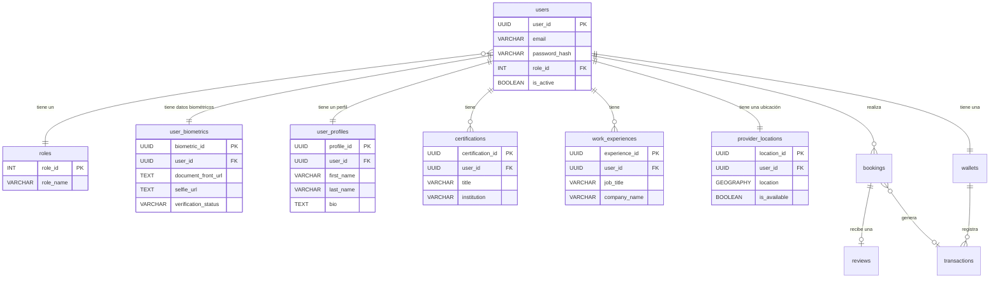

# Diagrama de Entidad-Relación (ERD) - LABURAPP

Este documento contiene una representación visual del esquema de la base de datos de los servicios principales de LABURAPP, utilizando la sintaxis de Mermaid para generar un diagrama de Entidad-Relación.

### Descripción de las Relaciones

*   `users` y `roles`: Un rol puede ser asignado a muchos usuarios, pero cada usuario tiene un único rol (`muchos a uno`).
*   `users` y `user_biometrics`: Cada usuario tiene un único registro de datos biométricos (`uno a uno`).
*   `users` y `user_profiles`: Cada usuario tiene un único perfil (`uno a uno`).
*   `users` y `certifications`: Un usuario (proveedor) puede tener múltiples certificaciones (`uno a muchos`).
*   `users` y `work_experiences`: Un usuario (proveedor) puede tener múltiples experiencias laborales (`uno a muchos`).
*   `users` y `provider_locations`: Cada usuario (proveedor) tiene un único registro de su última ubicación conocida (`uno a uno`).
*   `users` y `bookings`: Un usuario puede ser el cliente o el proveedor en muchas reservas (`uno a muchos`).
*   `users` y `wallets`: Cada usuario tiene una única wallet (`uno a uno`).
*   `bookings` y `reviews`: Cada reserva puede tener una única reseña (`uno a uno`).
*   `wallets` y `transactions`: Una wallet puede tener muchas transacciones (`uno a muchos`).
*   `bookings` y `transactions`: Una reserva puede estar asociada a una transacción (`uno a uno`, opcional).
