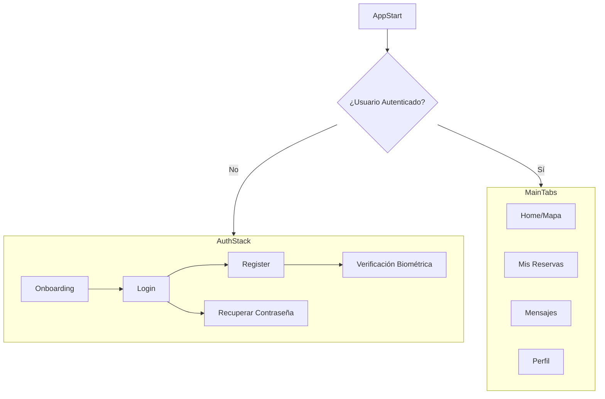

# Flujo de Pantallas y Navegación - LABURAPP

Este documento describe la estructura de navegación y los flujos de usuario principales para la aplicación móvil de LABURAPP.

## 1. Estructura de Navegación General

La navegación se basará en un `Conditional Navigator` que mostrará un `Auth Stack` si el usuario no está autenticado, y un `Main Tab Navigator` si sí lo está.

## 2. Flujos de Usuario Detallados

### 2.1. Flujo de Onboarding y Registro (Auth Stack)

1.  **Onboarding Screen:**
    *   Presentación de la app en varias diapositivas.
    *   Botones para "Iniciar Sesión" o "Registrarse".

2.  **Register Screen:**
    *   Formulario para solicitar email, contraseña y rol (Cliente/Proveedor).
    *   Al enviar, navega a `Biometric Verification`.

3.  **Biometric Verification Screen (para Proveedores):**
    *   Instrucciones para escanear el DNI (OCR) y tomarse una selfie.
    *   Utiliza la cámara del dispositivo para capturar las imágenes.
    *   Al completar, se envía al backend y se muestra un estado de "verificación pendiente".
    *   Navega al `Login Screen` o directamente al `Main Tab Navigator` con un estado de cuenta limitado.

4.  **Login Screen:**
    *   Campos para email y contraseña.
    *   Botón para "Iniciar Sesión con Biometría" (FaceID/Huella).
    *   Enlace a `Forgot Password Screen`.
    *   Al iniciar sesión exitosamente, se guarda el token y se navega al `Main Tab Navigator`.

### 2.2. Flujo Principal del Cliente (Main Tab Navigator)

1.  **Home Tab (Stack de Mapa):**
    *   **Map Screen:**
        *   Pantalla principal que muestra un mapa centrado en la ubicación del usuario.
        *   Marcadores en el mapa para los proveedores cercanos y disponibles.
        *   Filtros en la parte superior (categoría, distancia, rating).
        *   Al tocar un marcador, se muestra una tarjeta resumen del proveedor.
        *   Al tocar la tarjeta, navega a `Provider Profile Screen`.
    *   **Provider Profile Screen:**
        *   Muestra el perfil completo del proveedor (fotos, servicios, rating, certificaciones).
        *   Botón "Solicitar Servicio" que navega a `Booking Screen`.

2.  **Mis Reservas Tab (Stack de Reservas):**
    *   **Bookings List Screen:**
        *   Lista de reservas pasadas y futuras.
        *   Cada elemento de la lista es navegable a `Booking Details Screen`.
    *   **Booking Details Screen:**
        *   Muestra los detalles de una reserva específica.
        *   Permite al cliente cancelar la reserva (si aplica).
        *   Botón para chatear con el proveedor (navega a `Chat Screen`).
        *   Si el servicio está finalizado, pide al usuario que deje una calificación (navega a `Review Screen`).

3.  **Mensajes Tab (Stack de Chat):**
    *   **Chat List Screen:** Lista de conversaciones activas.
    *   **Chat Screen:** Interfaz de chat en tiempo real con un proveedor específico.

4.  **Perfil Tab (Stack de Perfil):**
    *   **Profile Screen:**
        *   Muestra la información del perfil del usuario.
        *   Opción para "Cambiar a Modo Proveedor" (si aplica).
        *   Acceso a `Settings Screen` y `Wallet Screen`.
    *   **Wallet Screen:** Muestra el saldo y el historial de transacciones.

### 2.3. Flujo Principal del Proveedor (Main Tab Navigator)

El proveedor ve el mismo Tab Navigator, pero algunas pantallas tienen funcionalidades diferentes.

1.  **Home Tab:**
    *   En lugar de buscar, el proveedor ve un dashboard con su estado actual ("Disponible" / "No Disponible").
    *   Botón para activar/desactivar su disponibilidad.
    *   Estadísticas rápidas (ganancias del día, próximas reservas).

2.  **Mis Reservas Tab:**
    *   La lista de reservas incluye solicitudes pendientes que puede `Aceptar` o `Rechazar`.
    *   En los detalles de una reserva confirmada, puede marcarla como `Completada`.

3.  **Perfil Tab:**
    *   El `Profile Screen` permite editar su perfil profesional (añadir certificaciones, cambiar tarifas, etc.).
    *   La `Wallet Screen` incluye la opción de "Retirar Saldo".
